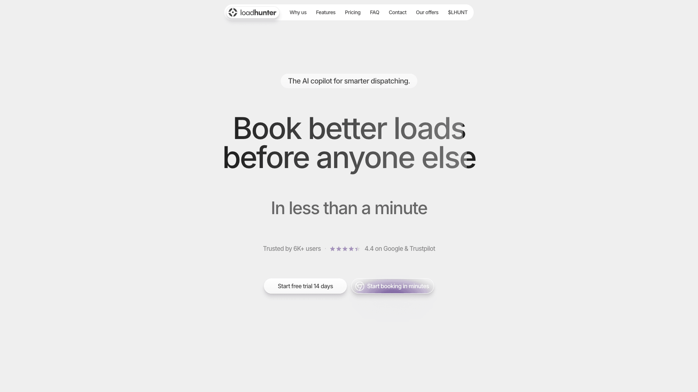

# LoadHunter — Landing Page

Marketing site for **LoadHunter**, an AI copilot for freight dispatchers (browser extension for DAT, Truckstop and other load boards).

A pixel-perfect implementation of the Figma design — the full 1920px artboard is reproduced 1:1 (whole-page mean pixel deviation from the design render: **~1.1/255**, i.e. font antialiasing level), enriched with scroll animations and interactive pricing.



## Stack

- [React 19](https://react.dev) + TypeScript, built with [Vite](https://vite.dev)
- [Tailwind CSS 4](https://tailwindcss.com) — design tokens from Figma live in `src/index.css` (`@theme`)
- [GSAP](https://gsap.com) — scroll-reveal cascades, testimonials marquee
- [Lenis](https://lenis.darkroom.engineering) — smooth scrolling, synced with GSAP's ticker
- Static [Inter](https://rsms.me/inter/) (400–700) via Fontsource

## Getting started

```bash
npm install
npm run dev        # dev server (Vite, HMR)
npm run build      # typecheck + production build to dist/
npm run preview    # serve the production build
npm run lint       # oxlint
npm run typecheck  # tsc only
```

## How it's built

### Fixed design canvases (desktop / tablet / phone)

The page renders on a fixed-width canvas that scales uniformly to the viewport (`src/components/site/DesignFrame.tsx`), so hand-built HTML and exported Figma imagery stay pixel-identical at every screen size. Three canvases match the Figma adaptive frames and switch by viewport width (`useBreakpoint`):

| Canvas | Viewport | Figma frame | Sections |
|---|---|---|---|
| Desktop 1920 | ≥ 1024px | Full HD, 19 624px tall | `src/sections/*` |
| Tablet 768 | 640–1023px | Tablet, 19 032px tall | `src/sections/tablet/*` |
| Phone 390 | < 640px | Phone, 15 597px tall | `src/sections/phone/*` |

Sections are absolutely pixel-positioned; page heights match the artboards exactly.

### Sections

| Component | Content |
|---|---|
| `Navbar` | pill navigation with anchor links (smooth-scrolled through Lenis) |
| `Hero` | gradient headline, product mockup, extension settings popup |
| `Features` | partners logo strip + three feature cards |
| `DispatchIntro`, `Tools` | seven alternating feature blocks (Smart-board, Auto-emailing, Telegram, TMS, Map, Broker reviews, Profit calculator) |
| `Orbit`, `Ecosystem` | orbit graphic + ecosystem products card (loadhunter / huntTMS / huntPAY) |
| `WhyLoadHunter` | comparison table (HTML) over a glow backdrop |
| `ChaosDiagram` | "From chaos to AI-powered dispatch" diagram |
| `Pricing` | interactive plan cards — see below |
| `Testimonials` | live marquee of review cards |
| `Faq`, `Cta`, `Footer` | FAQ list, "Add to Chrome" card, footer with subscribe form |

Text, tables, buttons and lists are real HTML with exact Figma geometry; purely decorative visuals (product mockups, glows, orbit rings) are 2x PNG/SVG exports under `public/figma/`.

### Interactive pricing

`Pricing.tsx` replicates the production loadhunter.io calculator:

- 1–50 dispatchers on a draggable slider (non-linear zones anchored to the discount badges)
- team discount: 3 dispatchers → −10%, 4+ → −20%
- annual billing → extra ×0.9
- per-dispatcher price is truncated to cents, then multiplied by headcount — card prices update live

### Animations

- `src/lib/reveal.ts` — cascading scroll-reveal: headings, paragraphs, buttons, images and cards fade/rise in staggered batches (`ScrollTrigger.batch`) as they enter the viewport; runs once per element and respects `prefers-reduced-motion`
- Testimonials marquee drifts right-to-left; hovering a card smoothly eases the drift to a stop and lights the card with the design's violet hover state
- Partners logo strip drifts left-to-right in a seamless loop
- Orbit section: 15 badge pills orbit the centre mark clockwise on three dotted rings (~3–4 min per revolution), counter-rotating to stay upright

## Project layout

```
public/figma/        2x asset exports from the Figma file
                     (per-section subfolders + phone/ and tablet/ variants)
src/
  components/site/   DesignFrame (canvas scaler), useBreakpoint
  lib/reveal.ts      scroll-reveal system (GSAP ScrollTrigger)
  sections/          desktop sections (1920 canvas), pixel-positioned
  sections/tablet/   tablet sections (768 canvas)
  sections/phone/    phone sections (390 canvas)
  index.css          Tailwind 4 theme: Figma color/typography/radius/shadow tokens
```
